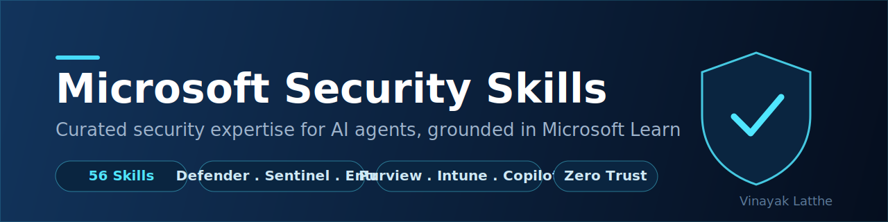

<p align="center">
  
</p>

<h1 align="center">Microsoft Security Skills Plugin</h1>

<p align="center">
  <a href="LICENSE"></a>
  
  
  
</p>

<p align="center">
  <a href="#install-in-60-seconds"><b>Install the plugin</b></a> .
  <a href="#which-skill-for-my-use-case"><b>Which skill do I use?</b></a> .
  <a href="#prompts-to-try"><b>Prompts to try</b></a>
</p>

---

Security work is not just a configuration problem. It is a decision problem: which control
applies here, what needs to be validated before a policy goes live, which investigation path to
follow, and what guardrails matter in this environment. The Microsoft Security Skills Plugin
packages security expertise into curated skills so compatible coding agents can give accurate,
opinionated Microsoft Security guidance instead of generic security advice.

- 56 curated Microsoft Security skills
- Coverage: Security, Identity and Management, Compliance and Privacy, Cloud platform security
- Compatible with GitHub Copilot, Claude Code, Cursor, Codex CLI, Gemini CLI, and other agentic hosts
- Public knowledge only, grounded in Microsoft Learn

## What this plugin delivers

### Security skills: the brain

This plugin ships **56 curated Microsoft Security skills** that teach an agent how security
work gets done across the Microsoft portfolio. Each skill provides workflows, decision trees,
and guardrails grounded in public [Microsoft Learn](https://learn.microsoft.com/security/)
documentation - no proprietary content.

Skills are grouped by portfolio area:

- **Threat protection and SecOps** with `defender-xdr`, `defender-for-endpoint`,
  `defender-for-identity`, `defender-for-cloud-hardening`, `sentinel`, `unified-secops-platform`,
  and `threat-modelling`
- **Identity, access, and governance** with `entra-id`, `entra-id-governance`,
  `entra-id-protection`, `entra-permissions-management`, `conditional-access-mfa`,
  `azure-pim`, and `windows-hello`
- **Compliance and data protection** with `purview-dlp-policy`, `purview-advanced-dlp`,
  `purview-ediscovery`, `purview-audit`, `purview-data-classification`,
  `purview-data-lifecycle`, `purview-communication-compliance`, `insider-risk-baseline`,
  and `microsoft-priva`
- **Endpoint and device management** with `intune-device-mgmt`, `intune-app-protection`,
  `bitlocker-design`, and `paw-design`
- **Cloud and platform security** with `azure-policy`, `azure-key-vault`,
  `azure-network-security-design`, `azure-firewall`, `azure-app-service-security`,
  `cloud-app-security-posture`, and `api-security-design`
- **Security operations acceleration** with `security-copilot`, `security-copilot-agents`,
  `compromise-recovery`, and `azure-site-recovery`

## Why this plugin is different

This is not a prompt pack. It is a packaged Microsoft Security capability layer:

- **Skills** teach the agent when to use each security workflow and what to avoid.
- **Guardrails** are built into every skill to prevent common implementation mistakes.
- **Public knowledge only** - every skill cites Microsoft Learn; no proprietary methodology
  or customer data is included.
- **Multi-host support** lets you use the same security capability across GitHub Copilot in
  VS Code, Copilot CLI, Claude Code, Cursor, Codex CLI, Gemini CLI, and other compatible hosts.

## What you get

| Component | What it adds | Scope |
|---|---|---|
| **56 Microsoft Security skills** | Expertise, decision trees, workflows, and guardrails across the Microsoft Security portfolio | Security, Identity and Management, Compliance and Privacy, Cloud platform security |

## Install in 60 seconds

### Prerequisites

Before you install, make sure you have:

- **Git** installed and accessible from the command line
- **Node.js 18+** available on your PATH if you plan to use `npx skills add` to install

You can verify these with:

```bash
git --version
npx --version
```

### APM (one install, multiple harnesses)

The Microsoft Security Skills Plugin supports [APM](https://github.com/microsoft/apm). One
command installs it across GitHub Copilot, Claude Code, Cursor, OpenCode, Codex, and Gemini:

```bash
apm install microsoft/microsoft-security-skills
```

### Universal install (all hosts)

Clone the repository and point your agent at the `skills/` directory:

```bash
git clone https://github.com/microsoft/microsoft-security-skills.git
```

Or use the skills CLI to install globally for a specific host:

```bash
# GitHub Copilot (VS Code, Copilot CLI)
npx skills add https://github.com/microsoft/microsoft-security-skills/tree/main/skills -a github-copilot -g -y

# Claude Code
npx skills add https://github.com/microsoft/microsoft-security-skills/tree/main/skills -a claude -g -y

# Cursor
npx skills add https://github.com/microsoft/microsoft-security-skills/tree/main/skills -a cursor -g -y

# Codex CLI
npx skills add https://github.com/microsoft/microsoft-security-skills/tree/main/skills -a codex -g -y
```

### Gemini CLI

**Install the extension**:

```bash
gemini extensions install https://github.com/microsoft/microsoft-security-skills
```

## Verify the installation

After install, try three quick checks.

### 1. Verify security skills

Ask:

> What Microsoft Defender controls should I prioritise for a new Microsoft 365 tenant?

You should get structured, product-specific guidance with Microsoft Learn references - not
generic security advice.

### 2. Verify identity skills

Ask:

> How do I design a Conditional Access policy baseline for a mid-size organisation?

You should get a policy framework with named Conditional Access templates and guardrails.

### 3. Verify compliance skills

Ask:

> What Purview DLP policies should I configure to protect sensitive data in Microsoft 365?

You should get scoped DLP guidance with workload-specific recommendations.

## Prompts to try

Once the plugin is installed, try prompts like these:

- `What are the first Defender XDR controls I should enable for a new tenant?`
- `Design a Conditional Access baseline for our Entra ID tenant.`
- `Help me build a Purview DLP policy to protect financial data.`
- `What Sentinel analytic rules should I enable for identity threat detection?`
- `How do I configure Entra ID Protection for risky sign-in response?`
- `Review my Intune device compliance policy for security gaps.`
- `What Defender for Cloud hardening recommendations apply to my Azure workloads?`
- `Help me design a PAW (Privileged Access Workstation) deployment.`
- `What Purview Insider Risk policies should I start with?`
- `How do I use Security Copilot to accelerate an incident investigation?`

## Which skill for my use case?

Use this table to pick the right skill before asking your question.

| If you want to... | Use this skill |
|---|---|
| Investigate a multi-product incident (endpoint + identity + email) | `defender-xdr` |
| Build or operate a SIEM, ingest logs, write KQL detections | `sentinel` |
| Merge Sentinel and Defender XDR into one portal for your SOC | `unified-secops-platform` |
| Use AI to help investigate or summarise incidents | `security-copilot` |
| Automate repetitive triage with autonomous AI agents | `security-copilot-agents` |
| Respond to an active breach or ransomware attack | `compromise-recovery` |
| Set up identity and access management (users, SSO, hybrid) | `entra-id` |
| Enforce MFA and access controls (Conditional Access) | `conditional-access-mfa` |
| Detect risky users or leaked credentials | `entra-id-protection` |
| Remove standing admin rights and implement JIT access | `azure-pim` |
| Govern identity lifecycle and access packages | `entra-id-governance` |
| Manage multicloud permissions across AWS, GCP, Azure | `entra-permissions-management` |
| Protect endpoints with EDR, attack surface reduction | `defender-for-endpoint` |
| Detect identity-based attacks on Active Directory | `defender-for-identity` |
| Protect email from phishing and business email compromise | `defender-for-office-365` |
| Harden cloud infrastructure posture (Secure Score, attack paths) | `defender-for-cloud-hardening` |
| Harden SaaS app configurations (M365, Salesforce, etc.) | `cloud-app-security-posture` |
| Manage Intune device compliance and configuration | `intune-device-mgmt` |
| Prevent data loss across Exchange, SharePoint, Teams, Endpoint | `purview-dlp-policy` |
| Find and classify sensitive data across your estate | `purview-data-classification` |
| Investigate legal or HR matters with eDiscovery | `purview-ediscovery` |
| Monitor what sensitive data flows through AI prompts | `purview-dspm-ai` |
| Fix oversharing before rolling out Microsoft 365 Copilot | `purview-copilot-oversharing` |
| Detect insider data theft or policy violations | `insider-risk-baseline` |
| Understand which Purview feature to use (orientation) | `purview-general` |
| Design a Zero Trust security architecture | `security-architecture` |
| Threat model a system with STRIDE | `threat-modelling` |
| Secure Azure network design (hub-spoke, NSG, private endpoints) | `azure-network-security-design` |
| Store and rotate secrets, keys, certificates | `azure-key-vault` |
| Enforce governance guardrails across Azure subscriptions | `azure-policy` |
| Protect APIs (OWASP API Top 10, APIM security) | `api-security-design` |
| Estimate cost of Azure security controls | `azure-pricing` |

> **Overlapping scenarios:** If your scenario spans multiple areas (e.g., a SOC involving both
> SIEM and XDR), start with the most specific skill and follow its cross-references.

## Portfolio coverage

| Product family | Coverage in this repo | Example skills |
|---|---|---|
| Security | Defender, Sentinel, SecOps workflows, threat modelling | `defender-xdr`, `sentinel`, `unified-secops-platform`, `threat-modelling` |
| Identity and Management | Entra, Conditional Access, governance, endpoint management | `entra-id`, `entra-id-governance`, `conditional-access-mfa`, `intune-device-mgmt` |
| Compliance and Privacy | Purview and Priva controls for data protection and compliance | `purview-dlp-policy`, `purview-ediscovery`, `purview-audit`, `microsoft-priva` |
| Cloud and platform security | Azure security architecture and control implementation | `azure-policy`, `azure-key-vault`, `azure-network-security-design`, `azure-firewall` |
| Security operations acceleration | Security Copilot and response-oriented workflows | `security-copilot`, `security-copilot-agents`, `compromise-recovery` |

## How agents use these skills

1. Agents scan skill front matter (`name`, `description`, and `WHEN:` triggers) to identify likely matches.
2. Agents load the most relevant `SKILL.md` files for detailed guidance.
3. Agents follow the skill body to produce focused, actionable outputs tied to Microsoft Learn references.

## Repository layout

The key pieces are:

- `skills/` - the Microsoft Security skill definitions, one subfolder per skill
- `plugin.json` - plugin metadata for agent harnesses
- `README.md` - high-level overview and install guide

```
skills/
  sentinel/SKILL.md
  defender-xdr/SKILL.md
  purview-dlp-policy/SKILL.md
  ...
```

## Skill format

Each `SKILL.md` follows a consistent structure:

```markdown
---
name: <skill-slug>
description: "<what it does>. WHEN: <trigger>, <trigger>, <trigger>."
license: MIT
metadata:
  author: Microsoft
  version: "0.1.0"
---

<concise, public-knowledge guidance, with Microsoft Learn links>
```

## Troubleshooting

### The agent is not using security skills

- Make sure the plugin installed successfully in your host.
- Confirm the `skills/` directory is present and contains `SKILL.md` files.
- Reload or restart your host so it re-indexes plugins and skill definitions.

### Skills are loading but responses seem generic

- The agent may not have matched a skill trigger. Try phrasing the prompt using product
  names directly (for example, "Defender XDR", "Purview DLP", "Entra Conditional Access").
- Check that the skill's `WHEN:` triggers in the `description` front matter cover your
  scenario. If they do not, open an issue or a pull request.

### A skill is missing for a product or scenario I need

- Check the `skills/` directory first - coverage may already exist under a different name.
- If genuinely missing, contributions are welcome. See the contributing guide below.

## Learn more

- [Microsoft Security documentation](https://learn.microsoft.com/security/)
- [Microsoft Defender XDR documentation](https://learn.microsoft.com/defender-xdr/)
- [Microsoft Sentinel documentation](https://learn.microsoft.com/azure/sentinel/)
- [Microsoft Entra documentation](https://learn.microsoft.com/entra/)
- [Microsoft Purview documentation](https://learn.microsoft.com/purview/)
- [microsoft/azure-skills](https://github.com/microsoft/azure-skills) - the Azure equivalent of this plugin

## Contributing

Contributions are welcome. Keep every skill:

- **Public-knowledge only** - cite Microsoft Learn; no proprietary methodology or customer data.
- **Focused** - one product or task per skill.
- **Concise** - guidance an agent can act on, not a full product manual.
- **Guarded** - include at least one guardrail section covering common mistakes.

This project welcomes contributions and suggestions. Most contributions require you to agree
to a Contributor License Agreement (CLA). For details, visit https://cla.opensource.microsoft.com.

## Trademarks

This project may contain trademarks or logos for projects, products, or services. Authorised
use of Microsoft trademarks or logos is subject to and must follow
[Microsoft's Trademark & Brand Guidelines](https://www.microsoft.com/legal/intellectualproperty/trademarks/usage/general).

## License

[MIT](LICENSE)
